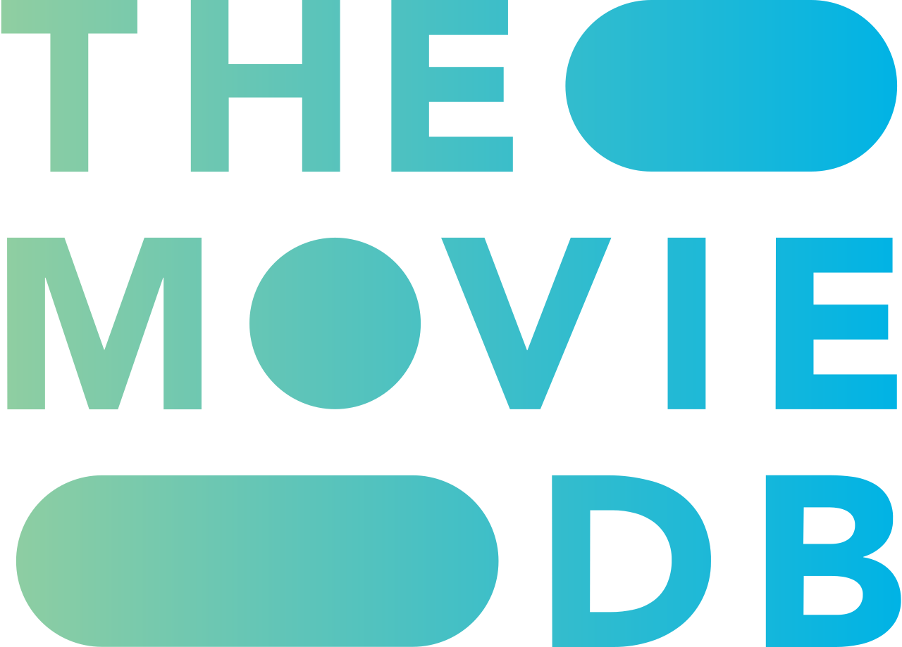

<div align="center">
  
</div>
<h4 align="center">Um app de filmes, venha conhecer mais!</h4>
<p align="center">
 <a href="#sobre">Sobre</a> •
 <a href="#executar">Como executar</a> • 
 <a href="#dir">Organização de Diretórios</a> • 
 <a href="#libs">Bibliotecas Utilizadas</a> • 
 <a href="#resultado">Resultado</a> • 
 <a href="#doc">Documentação</a> • 
 <a href="#tests">Testes</a> • 
 <a href="#autor">Autor</a>
</p>

<h2 id="sobre">🧾 Sobre</h2>
<p>Este projeto foi desenvolvido em React Native como solução de um desafio técnico! 👨‍💻</p>
<p>Essa é uma aplicação de listagem de filmes, onde temos três telas principais: a de listagem, de detalhes e a de pesquisa. Além disso, o aplicativo possui documentação com o storybook e cobertura de testes.</p>

<h2 id="executar">💻 Como executar</h2>

> **Nota**: Certifique-se de ter concluído as instruções de
> [Configuração do Ambiente do React Native](https://reactnative.dev/docs/environment-setup) até a
> etapa "Criando um novo aplicativo", antes de prosseguir.

<h3>Passo 1: Iniciando o Metro Server</h3>

Primeiro, você precisará iniciar o **Metro**, o _bundler_ JavaScript que acompanha o React Native.

Para iniciar o Metro, execute o seguinte comando a partir da raiz do seu projeto React Native:

```bash
# usando npm
npm start

# OU usando Yarn
yarn start
```

<h3>Passo 2: Iniciando aplicação</h3>

Deixe o Metro Bundler rodando em _seu próprio_ terminal. Abra um _novo_ terminal a partir da raiz do
seu projeto React Native. Execute o seguinte comando para iniciar o seu aplicativo _Android_ ou
_iOS_:

<h4>Para Android</h4>

```bash
# usando npm
npm run android

# OU usando Yarn
yarn android
```

<h4>Para iOS</h4>

```bash
# usando npm
npm run ios

# OR usando Yarn
yarn ios
```

Se tudo estiver configurado corretamente, em breve você deverá ver o aplicativo rodando no seu
Emulador Android ou Simulador iOS, desde que você tenha configurado o emulador/simulador
corretamente.

Essa é uma forma de executar o aplicativo — você também pode executá-lo diretamente do Android
Studio e Xcode, respectivamente.

<h2 id="dir">📁 Organização de Diretórios</h2>

    .
    ├── ...
    ├── __tests__ # Configurações de teste
    ├── __mocks__ # Arquivos de mock
    ├── src # Código fontes JavaScript
    │   └── @types # Definições dos tipos usados no projeto
    │   └── assets # Assets da aplicação
    │   └── components # Componentes genéricos da aplicação
    │   └── configs # Configurações globais
    |       └── theme # Tema do app
    |       └── jest.setup # Configurações de teste
    │   └── constants # Constantes do app
    │   └── features # Cada feature do app
    │   └── services # Configuração da api
    |   └── store # Gerenciamento de estado global
    |       └── sagas # Sagas do redux
    |       └── slices # Slices do redux
    └── ...

<h2 id="libs">📚 Bibliotecas Utilizadas</h2>
<p>As principais bibliotecas externas utilizadas nesse projeto foram:</p>
<ul>
  <li>React Navigation: para a criação da navegação e das rotas presentes no aplicativo.</li>
  <li>React Native Vector Icons: usada para a criação dos ícones do aplicativo.</li>
  <li>ESLint: para manter a formatação de código padrão.</li>
  <li>Prettier: para formatar o código. Trabalha em conjunto com o ESlint para manter a formatação.</li>
  <li>Jest e React Native Testing Library: para a criação de testes unitários.</li>
  <li>Storybook: para a documentação dos principais componentes do projeto.</li>
  <li>Axios: para a realização da integração com as APIs.</li>
</ul>

<h2 id="resultado">📱 Resultado</h2>
<div align="center">

https://github.com/davidsonmarra/themoviedb-app-rn/assets/80720221/56c28491-902e-4b94-a989-ee0b750971c2


</div>

<h2 id='doc'>📖 Documentação</h2>
<p>
  Toda a documentação foi desenvolvida com o Storybook.  
</p>
<div align="center">
  
https://github.com/davidsonmarra/themoviedb-app-rn/assets/80720221/5a149006-6055-4cb9-a7b5-6a7e6c6f3819

</div>

<h2 id='tests'>⚙️ Cobertura de Testes</h2>
<div>

Utilizei de TDD para garantir que a maior parte da minha aplicação fosse testável, e isso pode ser evidenciado nos commits. Todos os componentes e features só subiram mediante testes.

</div>

<h2 id="autor">👨‍💻 Autor</h2>
<table>
  <tr>
    <td align="center">
      <a href="https://github.com/davidsonmarra">
        <br>
        <sub>
          <b>Davidson Marra</b>
        </sub>
      </a>
    </td>
  </tr>
</table>
